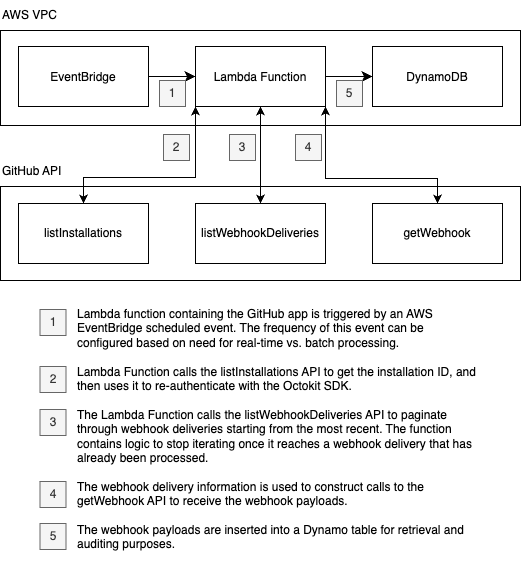

# GitHub Webhook Redelivery

This repository contains an AWS Lambda function that will query an organization's webhook deliveries and store them in DynamoDB. This allows users with networks that restrict incoming webhooks to move to a poll-based approach.

## Example Architecture
